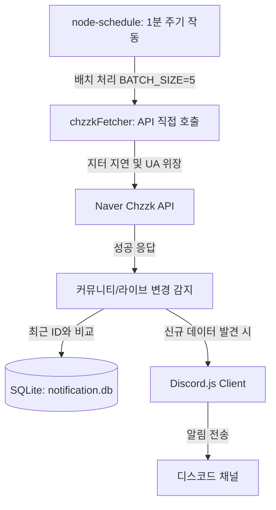

# 치지직 커뮤니티 / 라이브 알림 디스코드 봇 (로컬 통신 에디션)

치지직 스트리머의 **라이브 방송 시작** 및 **새로운 커뮤니티 게시글** 알림을 지정한 디스코드 채널로 실시간 전송해주는 디스코드 봇입니다. 
싱글 인스턴스 환경에 최적화되어 서버 리소스를 최소화하며, 로컬 환경에서 직접 통신하되 무작위 요청 지연(Jitter) 및 브라우저 헤더 위장을 도입하여 네이버 API 요청 차단(Rate Limit)을 방지합니다.

> [!WARNING]
> **⚠️ 소규모 및 개인용 구동 권장 (API 차단 제한 사항)**
> * 본 배포 에디션은 다중 프록시 노드 분산 호출 및 고가용성(HA) 다중화 기능이 배포 단순화를 위해 제거되고, 오직 **로컬 단일 인스턴스(싱글 노드)의 직접 통신**만을 활용하도록 변경되었습니다.
> * 하나의 로컬 IP 주소로만 네이버 API를 집중 호출하기 때문에, 무수히 많은 스트리머(수십 명 이상)를 한 번에 등록하여 대규모 공용 봇 서비스 형태로 운영할 경우 **네이버 서버로부터 API 호출 차단(Too Many Requests) 또는 강제적인 알림 지연이 발생하여 봇이 멈출 수 있습니다.**
> * 본 배포본은 본인의 개인 디스코드 서버 혹은 소수의 친목 서버용으로 직접 호스팅하여 가동하는 **"개인 전용(Self-Hosted) 봇"** 목적으로 사용할 것을 강력히 권장합니다.

---

## ⚡ 공용 봇 서비스로 즉시 이용하기

서버 호스팅이나 개별 개발자 토큰 발급, 데이터베이스 세팅 등의 번거로운 구축 과정 없이 **아무런 조건 없이 봇을 바로 사용하고 싶다면**, 이미 24시간 가동 중인 공용 알림 봇을 본인의 디스코드 서버에 초대하여 즉시 사용하실 수 있습니다. 

> [!NOTE]
> **💡 공식 공용 알림 봇의 뛰어난 안정성**
> * 본 깃허브 오픈소스(싱글 노드 직접 통신) 버전과 달리, **공식 공용 봇 서비스는 고가용성(HA) 다중화 설계 및 전 세계 각국에 분산된 수많은 프록시 노드(글로벌 IP 분산 구조)를 기반으로 네이버 API를 호출합니다.**
> * 이를 통해 대규모 채널에서 무수히 많은 스트리머를 동시 모니터링하더라도 네이버의 API 호출 횟수 제한(Rate Limit)이나 일시적 IP 차단 문제로부터 완벽하게 자유로우며, 오류 및 지연 없는 실시간 알림 서비스를 상시 제공받으실 수 있습니다.

* **공용 봇 사용 가이드**: [치지직 알림 봇 공식 가이드 페이지](https://azestkingscrown.cloud/chzzk-bot-guide)
* **공용 봇 초대**: [디스코드 봇 초대하기 (애플리케이션 링크)](https://discord.com/discovery/applications/1491633594014236805)
* **익명 1:1 문의 채널**: [오류 제보 및 익명 문의 서버 입장](https://discord.gg/5kGXA7TqeC)

> [!TIP]
> 봇의 서버 유지비 지출이나 패키지 갱신 관리 없이 바로 사용하길 원하시는 일반 사용자 분들은 위 공식 공용 봇의 초대 및 이용을 적극 권장합니다.

---

## 🚀 주요 특징

1. **경량 SQLite 데이터베이스 관리**
   - 기존의 JSON 파일 관리 방식 대신 경량 관계형 데이터베이스(SQLite 3)를 채택하여 채널별 스트리머 구독 데이터를 안전하고 효율적으로 관리합니다.
2. **효율적인 로컬 직접 통신 (`chzzkFetcher.js`)**
   - 다수의 디스코드 채널이 동일한 스트리머를 구독하더라도 스트리머당 1분당 최대 1회의 네이버 API 호출만 수행하도록 최적화되어 있습니다.
   - 네이버 API 호출 시 브라우저 헤더 위장 및 0.1~0.3초 사이의 무작위 요청 지터(Jitter)를 적용하여 차단(Block) 위험을 낮췄습니다.
3. **명령어 자동 배포 지원**
   - 디스코드의 최신 슬래시 명령어(Slash Commands) 규격을 완벽 지원하며, 스크립트를 통해 슬래시 명령어를 디스코드 API에 원클릭으로 쉽게 등록할 수 있습니다.
4. **ARM64 환경 완벽 지원**
   - Oracle Cloud Ubuntu ARM64 (Ampere® Altra®)를 비롯한 모든 서버 환경(Linux, macOS, Windows)에서 호환됩니다.

---

## 🛠️ 내부 작동 원리



1. **스케줄러 구동**: 1분 주기로 스케줄러가 구동되어 DB에 등록된 스트리머 정보를 가져옵니다. API 과부하 및 급격한 트래픽 유입을 막기 위해 5개 단위의 배치(Batch)로 나누어 병렬로 체크합니다.
2. **지연 및 호출**: `chzzkFetcher`가 네이버 서버에 직접 최신 상태 조회를 보냅니다. 봇 구동 환경에서 타 도메인을 거치지 않고 직접 통신합니다.
3. **데이터 매핑 및 전송**: 획득한 데이터(커뮤니티 글 ID, 라이브 방송 ID)가 SQLite 내부의 스트리머 기록 정보보다 최신일 경우, 이를 신규 게시글/방송으로 판단하여 해당 스트리머를 등록한 모든 디스코드 채널로 알림 메시지를 전송하고 데이터베이스를 업데이트합니다.

---

## 📦 설치 및 실행 방법

### 1. 사전 요구사항
- Node.js (v18 이상 권장)
- npm (Node Package Manager)

### 2. 의존성 패키지 설치
프로젝트 루트 폴더에서 아래 명령어를 실행하여 필요한 패키지를 설치합니다.
```bash
npm install
```

### 3. 설정 파일 작성 (`config.json`)
제공된 템플릿인 `config.template.json`을 복사하여 `config.json`을 생성하고, 사용자 환경에 맞게 내부 설정값을 채워넣습니다.
```bash
cp config.template.json config.json
```

**설정 필드 구성 설명**:
```json
{
  "token": "YOUR_DISCORD_BOT_TOKEN",         // 디스코드 개발자 포털에서 발급받은 봇 토큰
  "clientId": "YOUR_CLIENT_ID",               // 디스코드 봇 애플리케이션 ID
  "guildId": "YOUR_GUILD_ID",                 // 테스트 또는 명령어를 등록할 디스코드 서버 ID
  "channelId": "YOUR_DEFAULT_CHANNEL_ID",     // 기본 알림 발송 채널 ID
  "ownerId": "YOUR_DISCORD_USER_ID",          // 봇 소유자의 디스코드 고유 유저 ID (관리 명령어 권한 인증용)
  "api": {
    "community": "https://apis.naver.com/nng_main/nng_comment_api/v1/type/CHANNEL_POST/id/{streamerId}/comments?limit=10&offset=0&orderType=DESC&pagingType=PAGE",
    "live": "https://api.chzzk.naver.com/service/v2/channels/{streamerId}/live-detail",
    "channel": "https://api.chzzk.naver.com/service/v1/channels/{streamerId}",
    "search": "https://api.chzzk.naver.com/service/v1/search/channels?keyword={keyword}&size=1"
  }
}
```

### 4. 슬래시 명령어 배포
최초 실행 시 1회, 디스코드 서버에 봇 명령어를 등록해주어야 슬래시(`/`) 명령어를 정상 사용할 수 있습니다.
```bash
node deploy-commands.js
```

### 5. 봇 구동 시작
```bash
npm start
```

서버 백그라운드 환경에서 지속적으로 봇을 무중단 구동하려는 경우 `pm2` 사용을 강력히 권장합니다.
```bash
# pm2 전역 설치 (미설치 상태인 경우)
sudo npm install -g pm2

# 백그라운드 프로세스 등록 및 실행
pm2 start index.js --name chzzk-bot

# 서버 재부팅 시 자동 시작 설정 등록
pm2 save
pm2 startup
```

---

## 🎮 디스코드 명령어 가이드

디스코드 채팅 창에 슬래시(`/`)를 입력하여 실행할 수 있는 명령어 목록입니다. 본 봇은 편의성을 위해 **치지직 스트리머의 32자리 고유 ID 주입 방식**과 **닉네임 검색 매칭 방식** 두 가지 입력 루트를 모두 지원합니다.

| 명령어 | 매개변수 | 설명 |
| :--- | :--- | :--- |
| `/등록` | `스트리머` (닉네임 혹은 채널 고유 ID) | 현재 명령어를 입력한 채널에 해당 스트리머 알림을 등록합니다. |
| `/삭제` | `스트리머` (닉네임 혹은 채널 고유 ID) | 현재 채널에 등록되어 있던 스트리머 알림을 해제합니다. |
| `/리스트` | 없음 | 현재 채널에 등록되어 알림을 보내주는 스트리머 전체 명단을 출력합니다. |
| `/사용법` | 없음 | 슬래시 명령어 및 등록 방법 가이드를 채팅 메시지로 전송합니다. |
| `/핑` | 없음 | 디스코드 봇의 서버 응답 속도 및 상태를 즉시 테스트합니다. |
| `/설정_api` | `종류` (커뮤니티/라이브 등) , `주소` (새로운 API 주소) | **[봇 소유자 전용]** 치지직 API 스키마 변경 시 코드를 수정하지 않고 실시간으로 호출 URL을 업데이트합니다. |

### 🔍 스트리머 검색 및 추가 작동 상세 (2가지 방식)
1. **직접 ID 입력 방식**
   - 사용자가 스트리머 채널 주소(`https://chzzk.naver.com/xxxxxxxxxxxxxxxxxxxxxxxxxxxxxxxx`) 끝부분에 명시된 32자리 고유 해시 ID(예: `53c8344e2694f420e6e7683f124c8b2a`)를 직접 입력하는 경우입니다.
   - 봇은 즉시 채널 기본 정보 조회 API를 쏘아 채널 명과 프로필을 획득하고 등록을 진행합니다.
2. **닉네임(이름) 검색 방식**
   - 고유 ID를 외우거나 찾기 번거로울 때 닉네임 키워드(예: `한동숙`, `침착맨` 등)를 그대로 명령어에 입력하는 경우입니다.
   - 봇은 내부적으로 정규식 판별을 거쳐 ID 포맷이 아님을 감지하고, 네이버의 채널 키워드 검색 API를 호출하여 최상위 1순위로 조회된 채널의 고유 ID를 자동으로 추출 및 매칭하여 등록 절차를 밟습니다.

---

## 📄 데이터베이스 마이그레이션 안내
기존 버전에서 JSON 형식(`notification.json`)의 설정 파일을 사용해 오셨다면, 프로그램 구동 시 자동으로 데이터를 SQLite DB(`notification.db`)로 임포트하며, 완료 시 기존 파일은 `notification.json.bak`으로 안전하게 이름 변경 및 백업됩니다.

---

## 📝 네이버 치지직 연동 API 명세 (Technical Specification)

본 프로그램은 네이버 치지직(Chzzk) 플랫폼의 데이터를 파싱하기 위해 아래의 4가지 API 엔드포인트를 사용합니다. 해당 API들은 별도의 공식 인증 키(OAuth)를 요구하지 않는 공개 API이므로 헤더 위장 및 호출 속도 제어가 필요합니다.

### 1. 채널 기본 정보 조회 API
* **설정 필드**: `api.channel`
* **호출 주소**: `https://api.chzzk.naver.com/service/v1/channels/{streamerId}`
* **관련 구현 함수**: `utilItem.getChannelInfo(streamerId)` in `utils/util.js`
* **목적**: 등록하려는 치지직 채널의 유효성을 검증하고, 프로필 이미지와 채널명을 로컬 DB에 수집합니다.
* **주요 응답 데이터 파싱 필드**:
  - `code`: 상태 코드 (정상 시 `200` 반환)
  - `content.channelName`: 스트리머 닉네임 (예: `홍길동`)
  - `content.channelImageUrl`: 스트리머 프로필 사진 URL

### 2. 라운지(커뮤니티) 최신 게시글 조회 API
* **설정 필드**: `api.community`
* **호출 주소**: `https://apis.naver.com/nng_main/nng_comment_api/v1/type/CHANNEL_POST/id/{streamerId}/comments?limit=10&offset=0&orderType=DESC&pagingType=PAGE`
* **관련 구현 함수**: `utilItem.getCommunityRecentlyInfo(streamerId)` in `utils/util.js`
* **특수 헤더**: `'Content-Type': 'application/xml'`
* **목적**: 스트리머 커뮤니티 라운지의 최근 피드를 조회하여, 가장 마지막 글의 ID를 대조해 신규 글 작성 여부를 판별합니다.
* **주요 응답 데이터 파싱 필드**:
  - `code`: 상태 코드 (정상 시 `200` 반환)
  - `content.comments.data[0]`: 최신 게시글 객체
  - `content.comments.data[0].user.userNickname`: 작성자 닉네임
  - `content.comments.data[0].comment.commentId`: 게시글 ID (신규 여부 비교를 위한 기준 정수값)
  - `content.comments.data[0].comment.content`: 본문 텍스트 내용
  - `content.comments.data[0].comment.attaches[0].attachValue`: 첨부된 이미지 데이터 (있는 경우 본문에 첨부)

### 3. 실시간 라이브 상세 정보 조회 API
* **설정 필드**: `api.live`
* **호출 주소**: `https://api.chzzk.naver.com/service/v2/channels/{streamerId}/live-detail`
* **관련 구현 함수**: `utilItem.getLiveInfo(streamerId)` in `utils/util.js`
* **목적**: 스트리머의 라이브 송출 상태를 파악하고, 방송 제목, 카테고리 정보, 실시간 방송 썸네일 등을 파싱하여 방송 시작 알림을 발송합니다.
* **주요 응답 데이터 파싱 필드**:
  - `code`: 상태 코드 (정상 시 `200` 반환)
  - `content.status`: 현재 방송 유무 상태 (`OPEN`: 방송 중, `CLOSE`: 미방송 상태)
  - `content.liveId`: 방송 세션 고유 ID (중복 방송 시작 알림을 차단하기 위한 고유 대조 정수값)
  - `content.liveTitle`: 송출 중인 방송 제목
  - `content.liveCategoryValue`: 등록된 게임 카테고리 명칭
  - `content.liveImageUrl`: 실시간 방송 화면 스냅샷 (썸네일 크기 최적화 가변 템플릿 포함)
  - `content.channel.channelName` 및 `content.channel.channelImageUrl`: 해당 채널명과 채널 프로필 사진

### 4. 채널 키워드 검색 API
* **설정 필드**: `api.search`
* **호출 주소**: `https://api.chzzk.naver.com/service/v1/search/channels?keyword={keyword}&size=1`
* **관련 구현 함수**: `utilItem.searchStreamer(keyword)` in `utils/util.js`
* **목적**: 사용자가 스트리머 채널 32자리 고유 해시 ID 값을 모를 때, 닉네임이나 이름(키워드)으로 검색하여 ID를 대조 추출해내기 위해 작동합니다.
* **주요 응답 데이터 파싱 필드**:
  - `code`: 상태 코드 (정상 시 `200` 반환)
  - `content.data[0].channel.channelId`: 검색 결과 첫 번째 채널의 32자리 해시 ID
  - `content.data[0].channel.channelName`: 검색 결과 첫 번째 채널의 닉네임
  - `content.data[0].channel.channelImageUrl`: 채널 프로필 사진 URL
